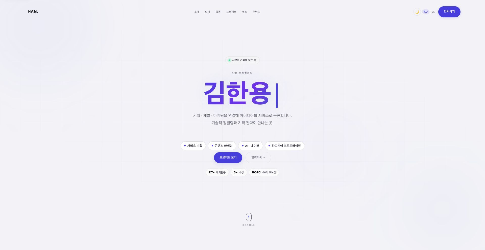
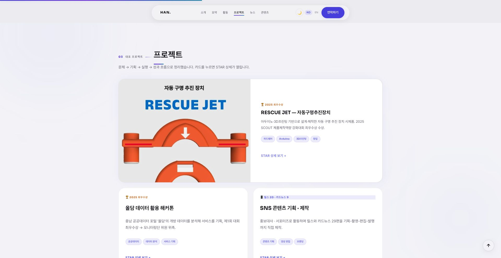
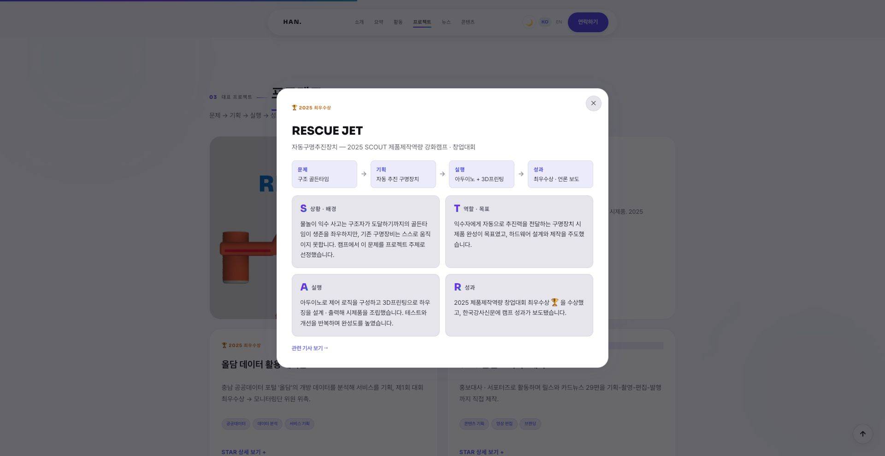
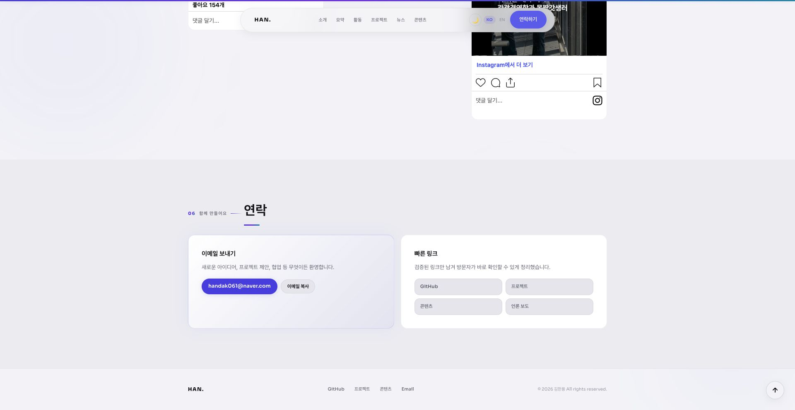
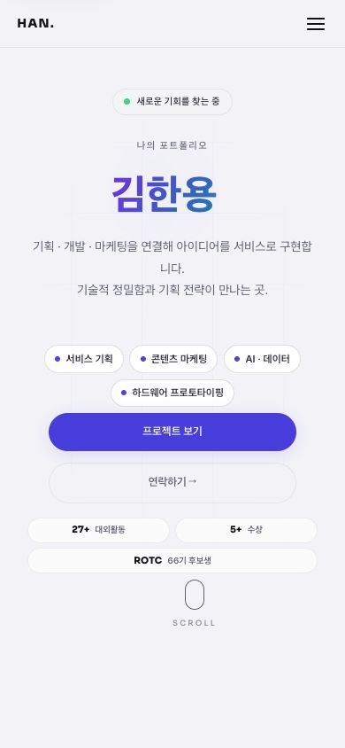
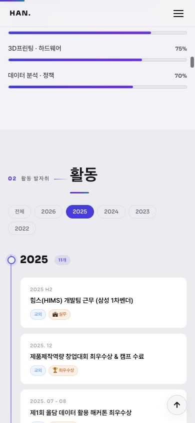
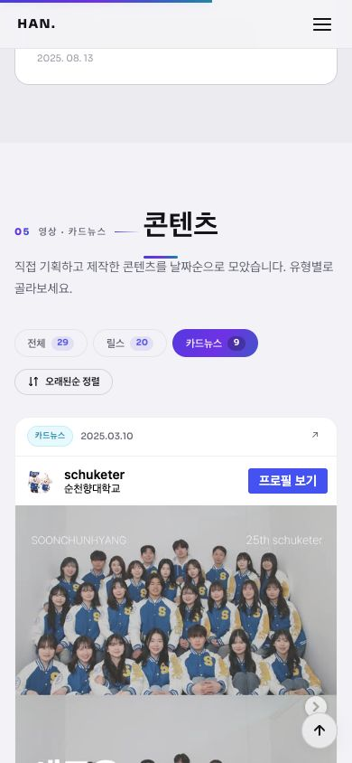

# 포트폴리오 현황 및 개편 준비 — 2026-09-06

실제 대상은 `http://localhost:5501/`의 김한용 포트폴리오다. 정적 HTML/CSS/JS 사이트이며 결제·장바구니·폼·checkout은 없다. 별도 결제 사이트의 주소가 제공되면 checkout 테스트를 별도로 해야 한다. 이 기록은 현재 화면 검사와 시안 제작 결과이며 개편 구현 완료 보고가 아니다.

## 확인한 흐름

1. **첫 진입 — 정상, 정보 우선순위 개선 필요.** 이름과 프로젝트 CTA가 보인다. 중앙 정렬, 보라색 그라데이션, 다수의 pill이 시각 언어를 반복한다. 프로젝트가 소개·역량·전체 활동 뒤에 있어 실제 작업을 빨리 파악하기 어렵다.

2. **프로젝트 이동 — 정상.** '프로젝트 보기'로 대표 작업 목록에 도달했다. RESCUE JET의 원본 이미지가 화면에서 잘려 전체 작업 맥락을 보기 어렵다. 대표 프로젝트를 첫 화면 가까이에 배치하고, 작업 이미지를 온전히 보여줄 것을 권한다.

3. **프로젝트 상세 — 정상.** RESCUE JET을 눌러 문제·기획·실행·성과 상세를 열었다. Escape 닫기 후 원래 프로젝트 카드로 포커스가 돌아왔다. 재설계에서도 키보드 제어와 포커스 복귀를 유지해야 한다.

4. **연락 — 화면 정상, 복사 결과 검증 제한.** 이메일 링크와 복사 버튼, 성공 토스트를 확인했다. 자동화 clipboard 읽기는 빈 값이어서 실제 시스템 클립보드 복사 성공까지는 확인하지 못했다. 소스의 `execCommand('copy')` 반환값 미확인으로 실패도 성공으로 표시될 수 있다. 이메일 발송은 수행하지 않았다.

5. **모바일 첫 화면·메뉴 — 정상.** 390×844에서 문서 폭은 390px로 수평 넘침이 없었다. 메뉴 열림과 링크 선택 후 닫힘을 확인했다. 초기 테스트 탭의 갤러리 위치·스크롤 상태가 불안정하여 새 탭에서 모바일 검증을 다시 수행했다. 아래는 새 탭에서 캡처한 유효한 첫 화면이다.

6. **활동 연도 필터 — 정상.** 모바일에서 2025를 선택하면 해당 연도만 보이고 선택 상태가 반영됐다. '전체'로 2022–2026 목록을 복원했다. 실제 활동 항목은 28개이나 소개 카운터는 26+, 다른 곳은 27+로 일관되지 않는다.

7. **콘텐츠 유형·정렬 — 정상, 갤러리 길이 개선 필요.** 카드뉴스 필터에서 9개만 표시됐다. 오래된순 정렬의 날짜가 2025.03.10부터 2026.06.28까지 오름차순임을 확인했다. 전체 29개 Instagram 임베드를 대표 콘텐츠 미리보기와 펼쳐 보는 기록으로 재구성하면 연락까지의 길이를 줄일 수 있다. 모든 외부 게시물의 재생·로그인·외부 링크는 검증하지 않았다.

## 구현 시 유지·개선할 항목

- 3개 프로젝트, 28개 활동, 29개 콘텐츠 및 기존 7개 상세 내용을 보존한다.
- 작업 → 개인 소개·역량 → 활동·콘텐츠 기록 → 연락 순서로 재구성한다.
- 클릭으로 작업 관점을 선택하고 내용이 전환되는 상호작용을 중심으로 만든다. 효과음은 명시적으로 켠 뒤에만 재생하고 끌 수 있게 한다.
- 모션 감소 설정에서는 스크롤·숫자·전환 애니메이션도 줄인다.
- localStorage 접근 실패가 사이트 초기화를 중단하지 않게 한다. 언어·테마 저장값은 허용값으로 제한한다.
- 클립보드 실패를 성공으로 알리지 않는다. 섹션 순서 개편 시 현재 탐색 표시도 실제 위치를 기준으로 계산한다.
- 제공된 원본 사진을 활용하고, 새 프로젝트나 성과 수치를 만들지 않는다.

## 보안 및 검증 범위

[소스 보안 검토](../security-review.md)에서 현재 정적 프런트엔드의 악용 가능한 취약점은 확인되지 않았다. 이는 서버·배포·CDN·외부 Instagram·결제에 대한 보증이 아니다. 화면 검사만으로 접근성 준수를 주장하지 않는다. 대규모 네트워크 스캔, 결제 거래, 외부 메시지 발송은 수행하지 않았다.

## 세 시안과 현재 상태

메인 채팅의 생성 이미지 표시 순서: 1=`concept-kinetic-type.png`, 2=`concept-object-index.png`, 3=`concept-field-notes.png`. 실제 표시 순서를 `concepts.json`에 기록했다. built-in ImageGen을 사용했으며 요청 1440×1024, 실제 출력 1487×1058이다. 모든 시안에 현재 사이트 캡처를 첨부했다. 2·3에는 RESCUE JET 원본도 첨부했다.

사용자는 별도 PNG가 없다고 답했다. 디자인 판단을 맡긴 원래 요청에 따라 3번 FIELD NOTES를 선택해 HTML/CSS/JS 개편을 구현했다. 생성한 시안 PNG로 공식 Template Creator 스크립트를 실행하여 개인 Product Design 이미지 템플릿 `Han Field Index`를 생성·검증했다([생성 기록](template-receipt.json)). 위 스크린샷과 이슈는 변경 전 감사 기록이다. 최신 결과는 [디자인 QA](../../design-qa.md)와 [최종 소스 검토](final-review.md)를 참고한다. 로컬 미리보기: http://localhost:4173/
